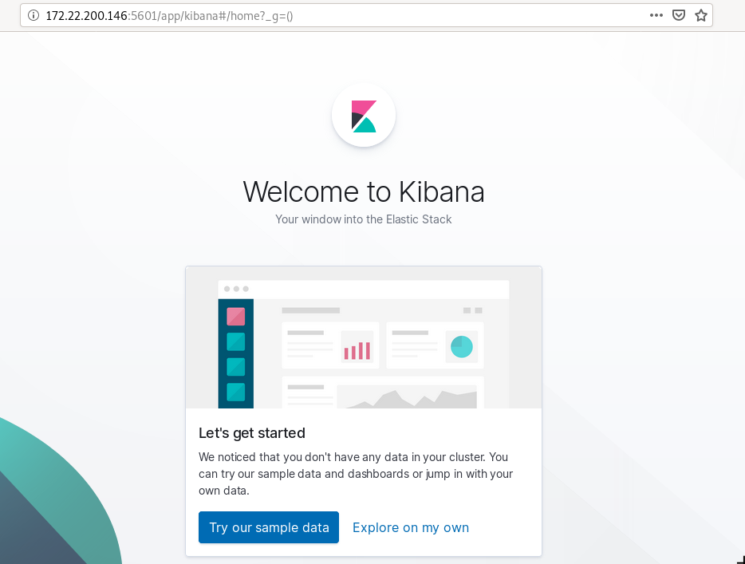
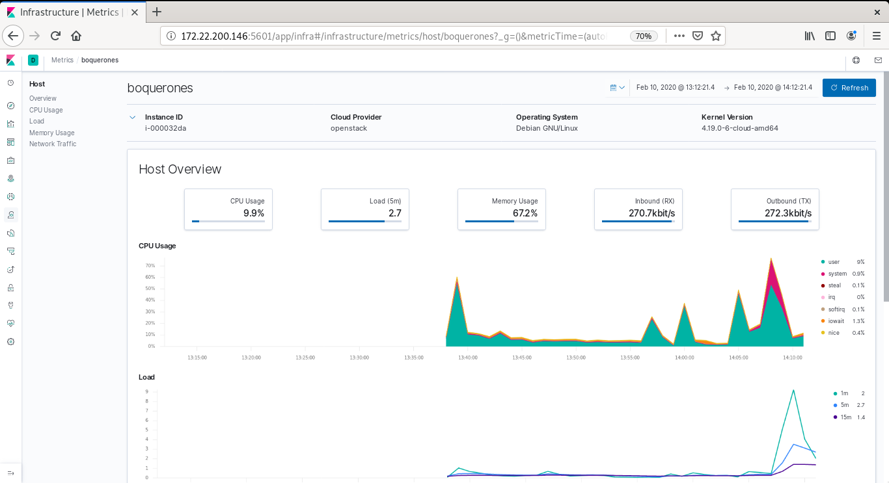
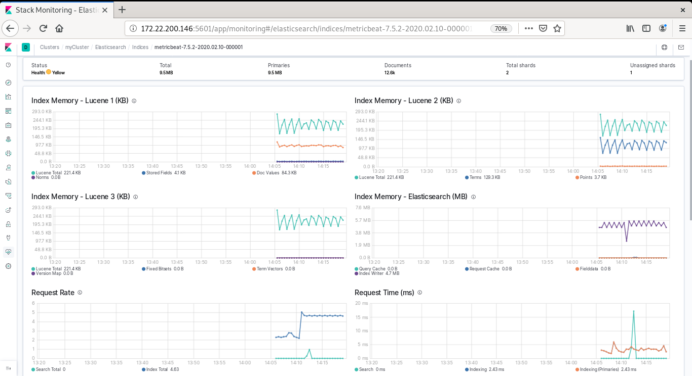

# KIBANA / ELASTICSEARCH / LOGSTASH / METRICBEAT
Para la recolección de datos y la gestión y representación gráfica de estos se crea una máquina, Serranito, con SO Debian 10. Las aplicaciones que se usarán son:
- **Elasticsearch**: Herramienta para la gestión y almacenamiento de datos.
- **Kibana**: Herramienta para la representación gráfica.
- **Logstash**: Herramienta para el procesamiento de datos.
- **Metricbeat**: Herramienta para recoger métricas.

### Elasticsearch
Es un motor de búsueda a la vez que una base de datos que funciona de forma distribuida. Es donde se procesa los datos. 

Toda la información será accesible, se podrá gestionar y actualizar. Es distribuido y escalable, los datos estarán disponibles a tiempo real (próximo a 3 o 4 segundos) y es de alta disponibilidad.

Los índices donde se almacenan pueden ser consutados de manera independiente, es lo que se conoce como Multi-tenancy. 

Por detrás se utiliza una especie de herramienta, Lucene, que permite busquedas full-text.

Tiene una API Resful sobre JSON para realizar e interactuar con Elasticsearch.

##### Almacenamiento de la información
- **Índice**: colección de documentos con características similares (una tabla si lo extrapolamos a bases de datos relacionales).
- **Documentos**: unidad básica de información (en formato JSON).
- **Shards**: es la forma de subdividir un índice en distintas partes. Al guardar la información se empaqueta y distribuye en los diferentes nodos en los que esté configurado.
- **Réplica**: la réplica de un shards se suelen distribuir en otros nodos. Elasticsearch permite realizar una o más copias de los shards.

Hay que distinguir entre shard primario y réplica. Solo se escribe en el primario y Elasticsearch se encarga de copiar en las réplicas. Las réplicas pueden cambiarse en caliente al contrario que los shards. 

> Existe una limitación de 2.147.000.000 documentos por shard. Por eso es conveniente distribuir los shard.

##### Instalación de Elasticsearch

> El sistema debe tener instalado el lenguaje de programación Java, ya que Elasticsearch está basado en Java. Para ello se va a descargar el siguiente paquete:
~~~
debian@boquerones:~$ sudo apt install default-jdk
~~~

Se comprueba la versión de java:
~~~
debian@boquerones:~$ java -version
openjdk version "11.0.6" 2020-01-14
OpenJDK Runtime Environment (build 11.0.6+10-post-Debian-1deb10u1)
OpenJDK 64-Bit Server VM (build 11.0.6+10-post-Debian-1deb10u1, mixed mode, sharing)
~~~

Es recomendable establecer la variable de entorno JAVA_HOME:
~~~
debian@boquerones:~$ echo $JAVA_HOME
/usr/lib/jvm/java-11-oracle
~~~

Se desarca la clave oficial de elasticsearch:
~~~
debian@boquerones:~$ wget -qO - https://artifacts.elastic.co/GPG-KEY-elasticsearch | sudo apt-key add -
OK
~~~

> Puede ser necesario el paquete gnupg para ello:
~~~
debian@boquerones:~$ sudo apt install gnupg
~~~

Para poder instalar desde un repositorio https se instala el paquete **apt-transport-https**:
~~~
debian@boquerones:~$ sudo apt install apt-transport-https
~~~

Y se añade el repositorio, que también servirá para la instalación de kibana y logstash:
~~~
debian@boquerones:~$ echo "deb https://artifacts.elastic.co/packages/7.x/apt stable main" | sudo tee -a /etc/apt/sources.list.d/elastic-7.x.list
deb https://artifacts.elastic.co/packages/7.x/apt stable main
~~~

Y se instala el paquete elasticsearch:
~~~
debian@boquerones:~$ sudo apt-get install elasticsearch
~~~

Se inicia el demonio y el inicio automatico del servicio:
~~~
debian@boquerones:~$ sudo /bin/systemctl daemon-reload
debian@boquerones:~$ sudo /bin/systemctl enable elasticsearch.service
Synchronizing state of elasticsearch.service with SysV service script with /lib/systemd/systemd-sysv-install.
Executing: /lib/systemd/systemd-sysv-install enable elasticsearch
Created symlink /etc/systemd/system/multi-user.target.wants/elasticsearch.service → /lib/systemd/system/elasticsearch.service.
~~~

Y por último se inicia el servicio:
~~~
debian@boquerones:~$ sudo systemctl start elasticsearch.service
~~~

##### Configuración de elasticsearch
Se modifica **/etc/elasticsearch/elasticsearch.yml** con la siguiente configuración:
~~~
path.data: /var/lib/elasticsearch
path.logs: /var/log/elasticsearch
discovery.seed_hosts : 10.0.0.6:9300
network.host: 10.0.0.6
cluster.name: myCluster
node.name: "boquerones"
transport.tcp.compress: true
bootstrap.system_call_filter: false
~~~

La última opción del fichero, **bootstrap.system_call_filter**, se utiliza para reservar memoria específica para este servicio. En nuestro caso no se va a user esta opción, pero si se quiere utilizar hay que cambiar false por true y modificar algunos parámetros de otros ficheros. 

Y se vuelve a iniciar el servicio.

##### Comprobación
Para ello se necesit el paquete curl:
~~~
debian@boquerones:~$ sudo apt install curl
~~~

Y se comprueba:
~~~
debian@boquerones:~$ curl -XGET 'http://10.0.0.6:9200/'
{
  "name" : "boquerones",
  "cluster_name" : "myCluster",
  "cluster_uuid" : "ogPXNl0dSmiZ1fKmOctFSQ",
  "version" : {
    "number" : "7.5.2",
    "build_flavor" : "default",
    "build_type" : "deb",
    "build_hash" : "8bec50e1e0ad29dad5653712cf3bb580cd1afcdf",
    "build_date" : "2020-01-15T12:11:52.313576Z",
    "build_snapshot" : false,
    "lucene_version" : "8.3.0",
    "minimum_wire_compatibility_version" : "6.8.0",
    "minimum_index_compatibility_version" : "6.0.0-beta1"
  },
  "tagline" : "You Know, for Search"
}
~~~

##### Introducción a la API - CLUSTER API
Permite consultar el estado del clúster.
- **Green**: todos los shards están bien indexados.
- **Yellow**: los shards primarios están bien pero las réplicas no.
- **Red**: shard no indexado.

Si se realiza la consulta, el resultado es yellow porque no tenemos réplicas.
~~~
root@boquerones:/home/debian# curl -XGET 'http://10.0.0.6:9200/_cluster/health?pretty'
{
  "cluster_name" : "myCluster",
  "status" : "yellow",
  "timed_out" : false,
  "number_of_nodes" : 1,
  "number_of_data_nodes" : 1,
  "active_primary_shards" : 4,
  "active_shards" : 4,
  "relocating_shards" : 0,
  "initializing_shards" : 0,
  "unassigned_shards" : 1,
  "delayed_unassigned_shards" : 0,
  "number_of_pending_tasks" : 0,
  "number_of_in_flight_fetch" : 0,
  "task_max_waiting_in_queue_millis" : 0,
  "active_shards_percent_as_number" : 80.0
}
~~~

### Kibana
##### Instalación de Kibana
Kibana permite visualizar los datos almacenamos en Elasticsearch y navegar a través de la Stack de Elastic. 

> Una buena práctica sería repartir estos servicios en diferentes nodos.

Con el repositorio que se ha puesto anteriormente y el paquete, también instalado antes, **apt-transport-https** es muy sencilla la instalación de Kibana:
~~~
debian@boquerones:~$ sudo apt install kibana
~~~

Se reinicia el servicio:
~~~
debian@boquerones:~$ sudo systemctl start kibana.service 
~~~

##### Configuración de Kibana
La configuración se realiza en el fichero **/etc/kibana/kibana.yml**:
~~~
server.port: 5601
server.host: 10.0.0.6
elasticsearch.hosts: ["http://10.0.0.6:9200"]
logging.dest: /var/log/kibana/kibana.log
~~~

El útlimo parámetros **logging.dest** indica el fichero log de kibana. Para que funcione correctamente hay que crear el directorio en la ruta indicada e indicar el propietario correcto:
~~~
root@boquerones:/var/log# mkdir kibana
root@boquerones:/var/log# chown -R kibana:kibana /var/log/kibana/
~~~

A través del navegador se continúa la configuración de kibana. En este caso, se utiliza el navegador de la máquina anfitriona, luego, se introduce la IP flotante de la máquina remota seguida del puerto que utiliza kibana por defecto. Previamente se abren los puertos necesarios en openstack. 

### Logstash
##### Introducción a Logstash
Se encarga de procesar los datos y enviarlos a la base de datos (Elasticsearch). Está dividido en 3 partes: entrada, filtrado y salida. 

**INPUT**
La ingesta de datos puede ser de todas las formas, tamaños y fuentes. 

**FILTRADO**
Transformaciones al vuelo. Estructura los datos, trabaja con fingerprints para que no se repita información, reconoce fechas, etc.

**OUT**
Puede utilizar plugins para que salga por diferentes vias. En este ejercicio los datos van a ir a elasticsearch. 

##### Instalación de Logstash
Para instalar logstash, teniendo en cuenta que ya está el repositorio necesario:
~~~
debian@boquerones:~$ sudo apt install logstash
~~~

Se habilita el arranque automático de logstach con el arranque de la máquina:
~~~
debian@boquerones:~$ sudo systemctl enable logstash
~~~

Y se inicia el servicio.

### Metricbeats
##### Instalación de Metricbears
Servicio para recoger métricas del sistema operativo y los servicios corriendo en él como el uso de RAM, CPU, uso de disco...

Para la instalación de metricbeat se va a descargar el paquete .deb a través de la página oficiar de [elastic](https://www.elastic.co/es/downloads/beats/metricbeat)  se va a instalar con dpkg:
~~~
debian@boquerones:~$ curl -L -O https://artifacts.elastic.co/downloads/beats/metricbeat/metricbeat-5.4.2-amd64.deb
  % Total    % Received % Xferd  Average Speed   Time    Time     Time  Current
                                 Dload  Upload   Total   Spent    Left  Speed
  0     0    0     0    0     0      0      0 --:--:-- --:--:-- --:--:--    0     0    0     0    0     0      0      0 --:--:-- --:--:-- --:--:--    0 9966k    0  2521    0     0   1634      0  1:44:06  0:00:01  1:44:05   79 9966k   79 7973k    0     0  3146k      0  0:00:03  0:00:02  0:00:01 3100 9966k  100 9966k    0     0  3846k      0  0:00:02  0:00:02 --:--:-- 3845k
debian@boquerones:~$ sudo dpkg -i metricbeat-5.4.2-amd64.deb
~~~

Hay que actualizar los paquetes tras la instalación de Metricbeat para que se actualice a la última versión disponible porque es la que se va a utilizar.

##### Configuración de Metricbeats
Se va configurar el fichero **/etc/metricbeat/metricbeat.yml** de la siguiente manera:
~~~
metricbeat.config.modules:
  path: ${path.config}/modules.d/*.yml
  reload.enabled: false

setup.template.settings:
  index.number_of_shards: 1
  index.codec: best_compression

setup.kibana:
  host: "10.0.0.6:5601"

output.elasticsearch:
  hosts: ["10.0.0.6:9200"]

processors:
  - add_host_metadata: ~
  - add_cloud_metadata: ~
  - add_docker_metadata: ~
  - add_kubernetes_metadata: ~
~~~

Y se activan los módulos de **/etc/metricbeat/modules.d/** renombrando los módulos y quitándo disabled:
~~~
root@boquerones:/etc/metricbeat/modules.d# mv elasticsearch.yml.disabled elasticsearch.yml
root@boquerones:/etc/metricbeat/modules.d# mv kibana.yml.disabled kibana.yml
root@boquerones:/home/debian# mv /etc/metricbeat/modules.d/elasticsearch-xpack.yml.disabled /etc/metricbeat/modules.d/elasticsearch-xpack.yml
~~~

Otra opción para activar los módulos es:
~~~
sudo metricbeat modules enable <módulo>
~~~

Y se inicia el sistema:
~~~
root@boquerones:/etc/metricbeat# systemctl start metricbeat.
~~~

##### Comprobación
A través de Kibana aparecen las mertricas y motorización que Metricbeat está recogiendo:

##### Configuración en los clientes
Se va a instalar Metricbeat en los clientes.

**Croqueta**
Como croqueta es una máquina Debian, igual que boquerones, la instalación de Metricbeat es igual, cambiando algunos parámetros de configuración en **metricbeat.yml** y en los módulos:
~~~
setup.kibana:
  host: "boquerones:5601"
output.elasticsearch:
  hosts: ["boquerones:9200"]
~~~

**Tortilla**
Como es una máquina con Ubuntu tiene la misma configuración que croqueta.

**Salmorejo**
Se descarga la key:
~~~
[centos@salmorejo ~]$ sudo rpm --import https://packages.elastic.co/GPG-KEY-elasticsearch
~~~

A continuación, se crea el fichero de configuración del repositorio **/etc/yum.repos.d/elastic.repo** con el siguiente contenido:
~~~
[elastic-6.x]
name=Elastic repository for 6.x packages
baseurl=https://artifacts.elastic.co/packages/6.x/yum
gpgcheck=1
gpgkey=https://artifacts.elastic.co/GPG-KEY-elasticsearch
enabled=1
autorefresh=1
type=rpm-md
~~~

Y se instala:
~~~
[centos@salmorejo ~]$ sudo dnf install metricbeat
~~~

Después se configura los ficheros de configuración de metricbeat como en croqueta y tortilla.

### Filebeat
##### Instalación de Filebeat
En esta ocasión se va a emplear esta herramienta para recopiar logs y enviarlos a elasticsearch.

Teniendo en cuenta que anteriormente se ha instalado el repositorio correspondiente, esta aplicación se instala de la siguiente manera:
~~~
debian@boquerones:/etc/metricbeat/modules.d$ sudo apt install filebeat
~~~

##### Configuración de Filebeat
El fichero de configuración **/etc/filebeat/filebeat.yml** se configura de la siguiente manera:
~~~
filebeat.inputs:
- type: log
  enabled: false
  paths:
    - /var/log/syslog
filebeat.config.modules:
  path: ${path.config}/modules.d/*.yml
  reload.enabled: false
setup.template.settings:
  index.number_of_shards: 1
setup.dashboards.enabled: true
setup.kibana:
  host: "10.0.0.6:5601"
output.elasticsearch:
  hosts: ["10.0.0.6:9200"]
processors:
  - add_host_metadata: ~
  - add_cloud_metadata: ~
  - add_docker_metadata: ~
  - add_kubernetes_metadata: ~
~~~

Se habilitan los módulos necesarios:
~~~
sudo filebeat modules enable system elasticsearch kibana
~~~

Y se habilita con el siguiente comando:
~~~
sudo filebeat -e -v -c filebeat.yml
~~~

Y se reinicia el servicio.

